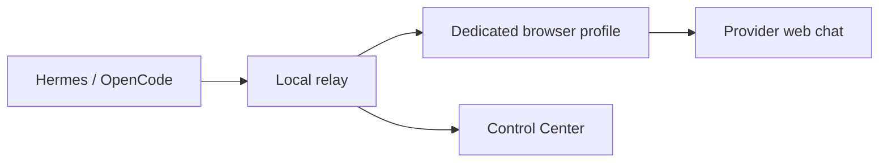

# Local AI Relay

**Use supported AI web chats from Hermes, OpenCode, or any
OpenAI-compatible client through one private local dashboard.**

[](https://github.com/Nan0pk/local-ai-relay/actions/workflows/ci.yml)
[](LICENSE)
[](#install)

[Check signed releases](https://github.com/Nan0pk/local-ai-relay/releases) ·
[Start from source](#start-from-source-today) ·
[Understand sign-in](#where-sign-in-happens) ·
[Troubleshoot](#when-something-is-not-working)

> [!IMPORTANT]
> This repository is a **release candidate**. There is no stable tagged
> installer in the repository yet. The release workflow is ready to publish
> authenticated Windows and Linux packages when a maintainer tags `v0.1.0`.
> Until then, use the source start below. Do not download an unofficial binary
> or run an unverified fork as your browser relay.

Local AI Relay is for a person who wants to get work done in an agent harness,
not maintain a provider integration. It starts a loopback-only server, opens a
polished Control Center, guides provider connection, safely configures a
harness, and shows useful errors in the same place.



## The three-minute flow

1. Start Local AI Relay. An authenticated install creates **Local AI Relay** in
   the Windows Desktop/Start Menu or the Linux application menu. The launcher
   starts or reuses the server and securely unlocks the dashboard.
2. In **Step 1 · Connections**, choose a provider. If sign-in is required, the
   relay opens the provider's real website in its dedicated browser profile.
   Complete password, passkey, 2FA, or CAPTCHA yourself.
3. After the provider says **Ready**, use **Step 2 · Work** to connect Hermes,
   OpenCode, or get settings for another OpenAI-compatible client. Launch the
   detected harness and work normally with model `relay-auto`.

Nothing silently falls back to fake output. A provider that has not passed a
real browser request is not offered to a harness.

## What you get

- One local web dashboard for relay health, provider status, connection
  progress, routing, harness setup, a test prompt, diagnostics, and cleanup.
- Visible provider sign-in on official provider pages. The relay never asks for
  a password, cookie, session token, or exported browser profile.
- Automatic routing across the providers you select, or manual model choice.
- Safe fallback only for failures known to occur **before** a prompt is
  submitted. Ambiguous timeouts or interrupted generations are not retried on
  another provider, preventing accidental duplicate work.
- Hermes and OpenCode detection, reversible config edits, a dedicated
  revocable key per harness, and one-click launch in a visible terminal.
- Generic OpenAI-compatible settings for testing another harness without
  changing Hermes or OpenCode.
- Local activity and error details, plus a setup doctor that checks Node,
  browser availability, desktop session, providers, and harnesses.
- No remote telemetry. The API binds to `127.0.0.1` by default and requires a
  bearer token.

## Install

### Signed release path

When `v0.1.0` appears on the
[Releases page](https://github.com/Nan0pk/local-ai-relay/releases), use the
bootstrap file attached to that exact release. The bootstrap verifies the
repository-bound GitHub attestation and checksum before installing anything.

Current authenticated bootstraps require:

- Windows x64 or Linux x64;
- Node.js 22 or newer;
- GitHub CLI (`gh`) for artifact-attestation verification;
- Chrome/Chromium, or permission for the relay to install managed Chromium on
  first provider connection.

Linux:

```bash
chmod +x bootstrap.sh
./bootstrap.sh --version v0.1.0
```

Windows PowerShell:

```powershell
.\bootstrap.ps1 -Version v0.1.0
```

Installation validates the release, starts the background relay, creates the
OS launcher, and opens the Control Center. It does **not** force a ChatGPT
probe or provider login during installation.

### Start from source today

Use this only until a signed release is published:

```bash
git clone https://github.com/Nan0pk/local-ai-relay.git
cd local-ai-relay
npm ci
npm run dashboard
```

Requirements are Git and Node.js 22+. `npm run dashboard` builds/starts or
reuses the relay, selects a free loopback port if `8787` is occupied, and opens
an auto-unlocked dashboard. Keep the checkout; it is the launcher for a source
install.

For a later source session:

```bash
cd local-ai-relay
npm run dashboard
```

## Where sign-in happens

There are two intentionally different browser links:

| Control | Opens | Uses that login for relay requests? |
|---|---|---|
| **Connect and sign in** | Official provider chat in a dedicated persistent relay profile | Yes |
| **Open account site in my browser** | Official provider page in your normal default browser | No |

The relay does **not** reuse your everyday Chrome profile. Sharing that live
profile with automation risks profile corruption, cookie exposure, and browser
locking. It also does not require a Chrome extension. The optional extension
in this repository is a Labs heartbeat/status companion only; it does not
carry prompts, copy sessions, or power provider automation.

For a provider that permits chat without an account, **Connect** still performs
a harmless real verification before showing **Ready**. For providers that
require an account, you remain in control of login, consent, 2FA, passkeys, and
CAPTCHA. Credentials are entered only into the provider's page.

## Providers and readiness

The Control Center currently knows browser adapters for ChatGPT, Claude,
Gemini, DeepSeek, Z.ai, MiniMax Agent, Kimi, Qwen Chat, Grok, Mistral Le Chat,
Meta AI, and LMSYS Chatbot Arena.

An adapter being listed is **not** a readiness claim. Provider websites change
without notice and may differ by account or region:

- **Available / Sign in** — adapter exists but has no current real evidence.
- **Connecting** — browser setup, login wait, or verification is running.
- **Ready** — a real response succeeded; evidence remains current for seven
  days and refreshes after successful real use.
- **Needs attention / Error** — open the linked activity entry for the exact
  classified failure and suggested recovery.

Production discovery and harness catalogs contain only ready real providers.
Mock providers exist only inside explicit deterministic test runs.

## Routing

Leave **Auto routing** on and select `relay-auto` in your harness for the
lowest-friction setup. The default policy favors reliability using current
readiness plus local success and latency observations.

Open **Provider choice and advanced routing** to:

- allow only selected providers;
- optimize for reliability or speed;
- set an explicit priority order;
- manually lock to one model;
- disable safe pre-submission fallback.

Routing decisions and reasons are written to the local activity journal.
Provider limits, quotas, safety controls, and terms still apply; the relay does
not bypass them.

## Harnesses

### Hermes

The dashboard detects the `hermes` executable in `PATH`, adds one named
`local-ai-relay` provider to `~/.hermes/config.yaml`, preserves unrelated
settings, backs up the prior file, and restores the prior model choice on
disconnect.

If Hermes is absent, use its
[official installation guide](https://hermes-agent.nousresearch.com/docs/getting-started/installation),
then refresh the dashboard.

### OpenCode

The dashboard detects `opencode` in `PATH` and adds only the
`local-ai-relay` provider entry to
`~/.config/opencode/opencode.json`. Existing providers and settings remain.

If OpenCode is absent, use its
[official installation guide](https://opencode.ai/docs/), then refresh.

### Any other harness

Choose **Generic OpenAI-compatible client → Get settings**. The dialog returns:

- base URL such as `http://127.0.0.1:8787/v1`;
- a dedicated revocable API key;
- model `relay-auto`.

This does not modify another application's files. Paste the values into that
client, test it, and disconnect the Generic integration when finished.

## Stop, switch, and remove

- To test another harness, connect it from the same dashboard. Every harness
  gets a separate key and can be disconnected independently.
- To remove relay configuration from one harness, click **Disconnect** beside
  it.
- To remove all harness integrations, click **Disconnect all** and confirm.
  Relay-owned entries are removed and all harness keys are revoked; unrelated
  settings remain.
- From a terminal, preview or apply the same cleanup:

```bash
npm run integrations:remove
npm run integrations:remove -- --yes
```

The first command is a no-change preview. Cleanup retains provider login
profiles, diagnostics, and the installed application so you can reconnect
later.

To fully uninstall, first disconnect all harnesses. Then stop/remove the
`local-ai-relay` user service or Windows scheduled task, remove the Local AI
Relay launcher, and delete only the installation directory. Delete
`~/.local-ai-relay` separately **only** if you also want to erase provider
profiles, readiness evidence, and local diagnostics.

## When something is not working

1. Click **Check setup**. Fix the first warning or failure from top to bottom.
2. If a provider failed, click **View error** on its card. The activity entry
   distinguishes login, CAPTCHA, quota, rate limit, layout change, disabled
   composer, timeout, and interrupted generation.
3. Reopen **Connect and sign in** if login expired. Do not paste cookies into
   `.env`.
4. Use the in-dashboard test prompt before blaming the harness.
5. Disconnect and reconnect the harness if its config points at an old port.

Useful source-install commands:

```bash
npm run dashboard       # start/reuse the relay and open the UI
npm run health:check    # local health diagnostic
npm run browser:install # explicitly install managed Chromium
npm run verify          # complete deterministic project verification
```

Browser failure screenshots are local and can contain prompt text. Disable
them with `RELAY_DIAGNOSTICS=0` when that tradeoff is preferable.

## Privacy and safety boundary

- Loopback binding and API authentication are defaults.
- The dashboard token is passed in a URL fragment by the local launcher,
  consumed by the page, and immediately removed from the visible URL. It is
  never stored in Local Storage or Session Storage.
- Provider profiles live under `~/.local-ai-relay/browser-profiles/` and are
  never exported by the relay.
- Prompts and provider responses necessarily pass through the selected
  provider's website. Do not send material that the provider is not permitted
  to receive.
- This is an unofficial interoperability project and is not affiliated with
  or endorsed by the listed providers.

## API and contributor entry points

The local service implements:

- `GET /health`
- `GET /v1/models`
- `POST /v1/chat/completions`
- `POST /v1/responses`
- authenticated `/v1/control/*` dashboard operations

See [the committed OpenAPI document](docs/openapi.json),
[architecture](docs/architecture.md), [provider contract](docs/providers.md),
and [contributor guide](CONTRIBUTING.md).

To add a future provider, implement the site-specific driver, register its
descriptor and model, add fixtures and typed failure tests, and require a real
probe before it enters ready discovery. A registry entry alone must never make
an adapter look usable.

Deterministic acceptance:

```bash
npm ci
npm run verify
```

Authenticated provider probes are intentionally operator-run because CI has
neither personal provider credentials nor a human desktop login session.

## License

Apache-2.0. See [LICENSE](LICENSE).
